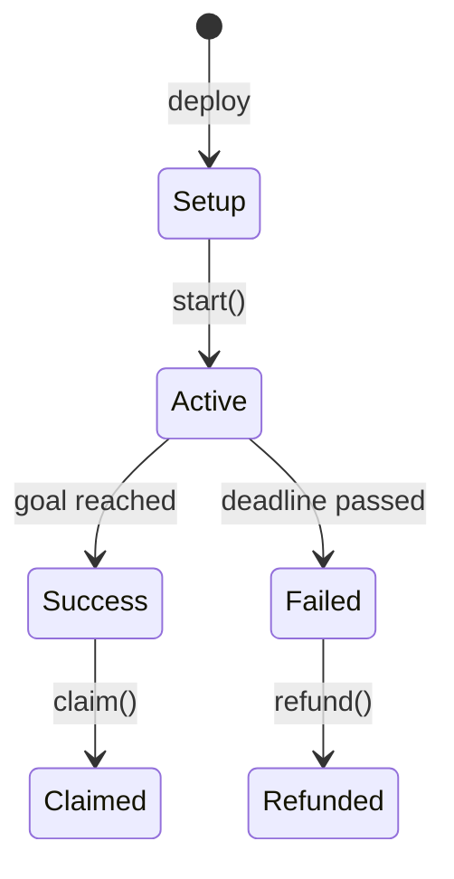

# Temporal Taint Model (TMP)

## Definition

Focus on **state machine transitions** and **time-based logic**. Can the system enter illegal states, skip required stages, allow time manipulation, or permit operations before/after their valid window?

## Core Question

> "Can an attacker force the system into a state it shouldn't be in, or bypass time-based restrictions through block manipulation, race conditions, or state machine violations?"

## The Verification Harness for Temporal Issues

### Step 1: Map State Machines

Document all state transitions in the protocol:

```markdown
## State Machine: Crowdfunding.sol



**Valid Transitions**:
| From | To | Trigger | Guards |
|------|-----|---------|--------|
| Setup | Active | start() | onlyOwner |
| Active | Success | contribute() | total >= goal |
| Active | Failed | time | block.timestamp > deadline |
| Success | Claimed | claim() | not claimed |
| Failed | Refunded | refund() | contributed |

**Invalid Transitions** (should be blocked):
- Setup → Failed (can't fail before starting)
- Setup → Claimed (can't claim without contributions)
- Failed → Success (can't succeed after failing)
- Claimed → Refunded (double spending)
```

### Step 2: Identify Time Dependencies

```markdown
## Time-Based Logic

| Function | Time Check | Purpose | Risk |
|----------|------------|---------|------|
| contribute() | deadline > block.timestamp | Ensure active | OK |
| claim() | state == Success | Ensure success | OK |
| emergencyWithdraw() | ??? | ??? | NO CHECK - RISK! |
| extendDeadline() | ??? | ??? | NO CHECK - RISK! |
```

### Step 3: Find Violations

```solidity
// VIOLATION: Emergency withdraw can happen anytime
function emergencyWithdraw() external onlyOwner {
    // Missing: require(state != Claimed, "Already claimed");
    payable(owner).transfer(address(this).balance);
    state = State.Withdrawn;
}

// Can be called even after successful funding!
```

### Step 4: Prove Exploitability

```solidity
// PoC: Double spending via state machine violation
function test_DoubleSpendViaStateViolation() public {
    // Setup: Campaign succeeds
    vm.warp(startTime);
    crowd.start();
    
    // Contributions
    vm.deal(user1, 100 ether);
    vm.prank(user1);
    crowd.contribute{value: 100 ether}();
    
    // Goal reached
    assertEq(crowd.state(), State.Success);
    
    // Owner claims funds
    vm.prank(owner);
    crowd.claim();
    assertEq(crowd.state(), State.Claimed);
    
    // ATTACK: Owner calls emergencyWithdraw
    // Missing check that state != Claimed
    vm.prank(owner);
    crowd.emergencyWithdraw();  // Succeeds! Double spending!
    
    // Owner got money twice
    assertGt(owner.balance, 100 ether);
}
```

### Step 5: Quantify Impact

- **Type**: State machine violation / Double spending
- **Maximum Loss**: All funds can be stolen twice
- **Prerequisites**: Owner compromised or malicious
- **Severity**: CRITICAL

### Step 6: Report and Remediate

```solidity
// Vulnerable
function emergencyWithdraw() external onlyOwner {
    payable(owner).transfer(address(this).balance);
    state = State.Withdrawn;
}

// Fixed
function emergencyWithdraw() external onlyOwner {
    require(
        state != State.Claimed && state != State.Refunded,
        "Already finalized"
    );
    state = State.Withdrawn;
    payable(owner).transfer(address(this).balance);
}
```

## Taint Framework

### SOURCE

Time and state transition sources:

```solidity
// Block timestamp (miner manipulable ±15 seconds)
block.timestamp

// Block number (predictable)
block.number

// State variables
enum Status { Pending, Active, Completed }
Status public status;

// Phase flags
bool public saleStarted;
bool public saleEnded;

// Time windows
uint256 public startTime;
uint256 public endTime;
uint256 public cliffTime;
uint256 public vestingEnd;
```

### SINK

Illegal state reached or time constraint bypassed:

```solidity
// State machine violation
status = Status.Completed;  // From Pending, skipping Active

// Time manipulation bypass
if (block.timestamp > deadline) {  // Should be >=
    // Action taken
}

// Phase skipping
function mint() external {
    // Missing: require(block.timestamp > whitelistEnd)
    _mint(msg.sender, 1);
}
```

### SANITIZER

State transition guards and time validation:

```solidity
// State transition guards
modifier onlyState(Status _status) {
    require(status == _status, "Wrong state");
    _;
}

function complete() external onlyState(Status.Active) {
    status = Status.Completed;
}

// Time guards
modifier onlyBefore(uint256 deadline) {
    require(block.timestamp <= deadline, "Too late");
    _;
}

modifier onlyAfter(uint256 start) {
    require(block.timestamp >= start, "Too early");
    _;
}

// Phase guards
modifier onlyPhase(Phase _phase) {
    require(currentPhase == _phase, "Wrong phase");
    _;
}

// Combined guards
function withdraw() external 
    onlyState(Status.Vesting) 
    onlyAfter(cliffTime) 
{
    // Safe to withdraw
}
```

## Common State Machines

### Crowdfunding

```solidity
enum State { Setup, Active, Success, Failed, Claimed, Refunded }

function contribute() external onlyState(State.Active) onlyBefore(deadline) {
    contributions[msg.sender] += msg.value;
    totalRaised += msg.value;
    
    if (totalRaised >= goal) {
        state = State.Success;
    }
}

function claim() external onlyState(State.Success) {
    state = State.Claimed;
    // Transfer funds to project
}

function refund() external onlyState(State.Failed) {
    state = State.Refunded;
    // Return contributions
}
```

### Auctions

```solidity
enum State { NotStarted, Bidding, Ended, Finalized }

function placeBid() external onlyState(State.Bidding) onlyBefore(endTime) {
    require(msg.value > highestBid, "Bid too low");
    // Refund previous bidder
    // Set new highest bid
}

function endAuction() external onlyState(State.Bidding) onlyAfter(endTime) {
    state = State.Ended;
}

function claimNFT() external onlyState(State.Ended) {
    state = State.Finalized;
    // Transfer NFT to winner
}
```

### Vesting

```solidity
enum State { Locked, Vesting, FullyVested }

function startVesting() external onlyOwner {
    startTime = block.timestamp;
    state = State.Vesting;
}

function claim() external onlyState(State.Vesting) {
    uint256 elapsed = block.timestamp - startTime;
    uint256 vested = totalAmount * elapsed / duration;
    
    if (vested >= totalAmount) {
        state = State.FullyVested;
    }
    
    // Transfer vested amount
}
```

### Governance

```solidity
enum State { Pending, Active, Canceled, Defeated, Succeeded, Queued, Executed }

function propose() external {
    proposalId = hash(targets, values, calldatas);
    proposals[proposalId].state = State.Pending;
    proposals[proposalId].eta = block.timestamp + votingDelay;
}

function activate() external {
    require(block.timestamp >= proposals[proposalId].eta);
    proposals[proposalId].state = State.Active;
}

function execute() external onlyState(State.Succeeded) {
    require(block.timestamp >= proposals[proposalId].eta + timelock);
    proposals[proposalId].state = State.Executed;
    // Execute actions
}
```

## Time Manipulation Vulnerabilities

### 1. Block Timestamp Manipulation

```solidity
// DANGEROUS: timestamp can be manipulated by miner
function isExpired() public view returns (bool) {
    return block.timestamp > deadline;
}

// Safer: Use block number for longer timeframes
function isExpired() public view returns (bool) {
    return block.number > deadlineBlock;
}

// Best: Accept small manipulation
function isExpired() public view returns (bool) {
    // Miner can manipulate by ~15 seconds
    return block.timestamp >= deadline + 15;
}
```

### 2. Flash Loan Timestamp Attacks

```solidity
// Vulnerable: Single-block timestamp dependence
governance.vote(proposal);  // Uses block.timestamp for voting weight

// Attacker:
// 1. Flash loan governance tokens
// 2. Vote in same block
// 3. Repay flash loan
```

### 3. Race Conditions

```solidity
// Vulnerable: Check-then-act race condition
function claimReward() external {
    require(rewards[msg.sender] > 0);
    
    // Attacker reenters here
    
    uint256 amount = rewards[msg.sender];
    rewards[msg.sender] = 0;
    token.transfer(msg.sender, amount);
}
```

## Detection Strategy

### Reverse Scan

Assert temporal violations exist:

```markdown
- "Users CAN mint during whitelist phase even if not whitelisted"
- "Auctions CAN be finalized before end time"
- "Locked tokens CAN be withdrawn early"
- "Paused contracts CAN still execute functions"
- "Governance CAN execute before voting period ends"
```

### Checklist

For each state variable and time check:

- [ ] Are all state transitions valid?
- [ ] Are invalid transitions blocked?
- [ ] Can time checks be bypassed?
- [ ] Can state be manipulated?
- [ ] Are there race conditions?
- [ ] Can miner manipulate block timestamp?

## Real-World Examples

### Example 1: Cream Finance (2021)

**Issue**: Flash loan voting in same block

```solidity
function vote(uint proposal) external {
    uint256 votes = token.balanceOf(msg.sender);  // Snapshot at vote time
    // ...
}
```

**Attack**: Flash loan → vote → repay in single transaction

**Fix**: Snapshot at proposal creation time

### Example 2: Beanstalk (2022)

**Issue**: No delay between governance actions

```solidity
function executeProposal() external {
    // No timelock, immediate execution
}
```

**Attack**: Flash loan governance takeover, immediate malicious proposal execution

**Fix**: Add timelock between proposal success and execution

### Example 3: Cover Protocol (2020)

**Issue**: State machine violation allowed double claim

```solidity
function claim() external {
    // No check if already claimed
    // Transfer tokens
}
```

**Attack**: Call claim() multiple times

**Fix**: Add claimed flag and check
